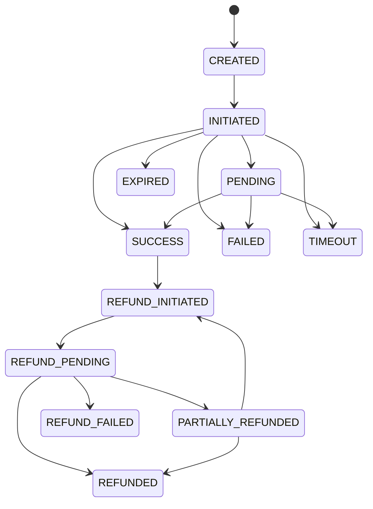

# PayFlow System Architecture (As-Built)

This document provides a comprehensive technical architecture description of the as-built **PayFlow** UPI orchestration and merchant billing platform.

---

## 1. System Overview & Component Topology

PayFlow is designed as a high-performance, multi-tenant merchant payment orchestration system tailored for the Indian UPI ecosystem. It features a reactive FastAPI core backend, PostgreSQL relational storage, Redis caching and distributed locking, Celery asynchronous task workers, and a cross-platform Flutter mobile client.

```mermaid
flowchart TB
    subgraph Clients["Client Layer"]
        Mobile["Flutter Mobile App (iOS / Android / macOS / Web)"]
        CustomerBrowser["Customer Checkout Browser (Web View / Chrome)"]
    end

    subgraph Edge["Gateway & Edge"]
        Nginx["Reverse Proxy / Docker Port Mapping (:8000)"]
        RateLimit["Redis Token Bucket Rate Limiter"]
    end

    subgraph Backend["Core Application Services"]
        FastAPI["FastAPI App (91+ Endpoints)"]
        subgraph Modules["Domain Modules"]
            AuthModule["Auth & RBAC (JWT, bcrypt)"]
            InvoiceModule["Invoices & Payment Plans"]
            PaymentModule["Payments & Finite State Machine"]
            MockUpiModule["NPCI / Mock UPI Simulator (7 Scenarios)"]
            WebhookModule["Inbound / Outbound Webhooks (HMAC-SHA256)"]
            ReconModule["Nightly Reconciliation & Settlements"]
            RiskModule["Risk & Structuring Engine"]
            AiModule["AI Assistant (Analytics Q&A)"]
        end
    end

    subgraph Async["Background & Queue Layer"]
        RedisBroker["Redis Message Broker (DB 1 / 2)"]
        CeleryWorker["Celery Workers (Async Tasks, Notifications, Webhooks)"]
        CeleryBeat["Celery Beat (Nightly Reconciliation Scheduler)"]
    end

    subgraph Storage["Data & Cache Layer"]
        Postgres["PostgreSQL 16 (Relational Ledger, JSONB, UUIDs)"]
        RedisCache["Redis 7 (Rate Limits, Idempotency Locks, Sessions)"]
        StaticUploads["Local Static File Store (/uploads)"]
    end

    Mobile -->|REST API / Bearer JWT| Nginx
    CustomerBrowser -->|GET /pay/{slug}, POST /payments/initiate| Nginx
    Nginx --> RateLimit
    RateLimit --> FastAPI

    FastAPI --> Modules
    Modules --> Postgres
    Modules --> RedisCache
    Modules --> StaticUploads
    Modules -->|Enqueue Tasks| RedisBroker

    RedisBroker --> CeleryWorker
    CeleryBeat -->|Schedule Cron| RedisBroker
    CeleryWorker --> Postgres
    CeleryWorker --> RedisCache
```

---

## 2. Core Architectural Principles

### 2.1 Server-Locked Amounts & Tamper-Proof Checkout
- Payment amounts are strictly server-computed from database records (`Invoice`, `PaymentRequest`, or `PaymentPlanInstallment`).
- Customer checkout endpoints (`GET /pay/{slug}`, `POST /payments/initiate`) do not trust client-supplied payment totals or query parameters.
- Amount manipulation attempts are trapped and flagged under `TAMPERED_AMOUNT` transactions and escalated to the risk engine.

### 2.2 Strict Idempotency Across Financial Mutations
- Every money-moving endpoint enforces the `Idempotency-Key` HTTP header.
- If a client replays an identical key within the idempotency window:
  1. The system checks `payment_transactions.idempotency_key`.
  2. If an existing transaction is found, it returns the cached HTTP response and transaction record immediately (200 OK) without re-initiating or double-charging.
  3. Redis atomic distributed locks (`SETNX`) guard against concurrent race conditions during in-flight processing.

### 2.3 Finite State Machine (FSM) Lifecycle
Transaction transitions are strictly validated by `PaymentStateMachine`:

- Every state transition is written to `transaction_status_history` with the prior status, new status, actor, timestamp, and triggering reason.
- Terminal statuses (`SUCCESS`, `FAILED`, `EXPIRED`, `REFUNDED`) reject invalid mutations with `HTTP 409 Conflict`.

### 2.4 Multi-Tenant Data Isolation
- Every core entity has a mandatory foreign key `merchant_id` with an explicit database index.
- RBAC dependencies (`verify_merchant_permission`) enforce that authenticated users cannot access or mutate resources outside their assigned merchant organization.

---

## 3. Backend Module Specifications

### 3.1 Authentication & RBAC (`app/modules/auth`, `app/modules/rbac`)
- **Tokens**: Stateless JWT access tokens (short-lived, 15m) + refresh tokens (7 days). Passwords hashed using `bcrypt` (12 rounds).
- **RBAC**: Configurable roles (`Owner`, `Manager`, `Cashier`, `Auditor`) mapped to granular permissions (`payments:write`, `refunds:approve`, `settlements:read`, etc.). Enforced via FastAPI dependency injection (`require_permission`, `verify_merchant_permission`).

### 3.2 Invoices, Installments & Anti-Structuring (`app/modules/invoices`, `app/modules/splits`)
- **Invoices**: Supports line items with automated subtotal, 18% GST calculation, and aggregate status calculation (`DRAFT` → `SENT` → `PARTIALLY_PAID` → `PAID` / `OVERDUE`).
- **Payment Plans**: Supports deposits, periodic installments, and project delivery milestones.
- **Anti-Structuring**: Automated heuristic checks flag rapid payment splitting attempts designed to evade regulatory reporting thresholds (e.g. repeated ₹99,000 splits just under ₹100,000 threshold).

### 3.3 Mock UPI Simulator (`app/modules/mock_upi_provider`)
Fully implements NPCI UPI switch behavior for realistic development and automated testing:
1. `SUCCESS`: Immediate simulated authorization and credit confirmation.
2. `FAILED`: Insufficient balance / bank decline simulation.
3. `PENDING`: Asynchronous customer approval state requiring polling or webhook callback.
4. `TIMEOUT`: Upstream banking provider timeout.
5. `EXPIRED`: VPA collect request expires without user action.
6. `TAMPERED_AMOUNT`: Intent QR amount tampering detected.
7. `DUPLICATE_PAYMENT`: Rapid replay or identical idempotency key collision.

### 3.4 Webhooks Inbound & Outbound (`app/modules/webhooks`)
- **Inbound Webhook**: Accepts simulator callbacks at `POST /webhooks/upi-mock/inbound`, validates HMAC-SHA256 signature against `X-Webhook-Signature`, prevents concurrency via Redis locks, and applies state machine transitions.
- **Outbound Webhook**: Dispatches events (`payment.success`, `payment.failed`, `refund.completed`, `refund.partial`) to registered merchant URLs with exponential backoff retries.

### 3.5 Reconciliation & Settlements (`app/modules/reconciliation`, `app/modules/settlements`)
- **Reconciliation**: Automated nightly comparison of internal payment records with mock banking settlement reports. Matches on `provider_ref_id`, expected net amount minus MDR (illustrative 1.5%), and transaction timestamp tolerance. Flags entries as `MATCHED`, `AMOUNT_MISMATCH`, or `MISSING_IN_PROVIDER`.
- **Settlements**: Aggregates reconciled batches into T+1 or on-demand settlements with simulated UTR numbers and line item breakdowns.

### 3.6 Risk Engine & Audit Logs (`app/modules/risk`, `app/modules/audit`)
- **Risk Signals**: Real-time evaluation of velocity, off-hours spikes, structuring patterns, and consecutive failures.
- **Audit Logs**: Immutable log of platform operations (`CREATE`, `UPDATE`, `DELETE`, `STATUS_CHANGE`, `REFUND_TRIGGER`) storing JSON diffs of before and after payloads, actor IDs, and IP addresses.

### 3.7 AI Assistant (`app/modules/ai_assistant`)
- Read-only Q&A over merchant data (analytics, revenue trends, top customers, overdue invoices, and settlements).
- Enforces grounded context injection (retrieves real database numbers before passing to model prompt; zero hallucination of financial figures).

---

## 4. Mobile Architecture (Flutter)

The Flutter mobile client located in `/mobile` is architected for point-of-sale operational efficiency:

```
mobile/lib/
├── core/                  # Network client (Dio), Config, App Theme, Secure Storage
├── routing/               # GoRouter configuration, Route paths, Auth guards
├── shell/                 # Responsive Shell with Drawer (all 13 modules) & BottomBar (top 4)
├── shared/                # StatusBadges, KpiCards, PaginatedListView, Empty/Error states
└── features/              # Feature modules (Notifier + Repository pattern)
    ├── auth/              # Login, Registration, Riverpod AuthNotifier
    ├── dashboard/         # KPI Summary cards, fl_chart revenue trend, method breakdown
    ├── invoices/          # List, Detail, Create form, Collect BottomSheet, QR Display
    ├── transactions/      # List, Detail, Camera QR Scanner
    ├── customers/         # Customer directory, Transaction history
    ├── settlements/       # Settlement batches & UTR detail
    ├── staff/             # Team management (Owner/Manager RBAC gated)
    ├── notifications/     # In-app alert center with read tracking
    ├── audit_logs/        # Audit log browser with before/after JSON diff viewer
    ├── risk_alerts/       # Real-time fraud and AML alerts with review actions
    ├── ai_assistant/      # Natural language merchant Q&A chat
    └── settings/          # Environment info & dynamic RBAC role switcher for demo
```

### 4.1 State Management & Dependency Injection
- **Riverpod 3**: Uses `AsyncNotifier` and `StateNotifier` for granular reactivity.
- **Strict Repository Pattern**: No UI widget invokes Dio directly; every API call flows through a typed repository returning immutable Dart models.

### 4.2 Auth Interceptor & Secure Storage
- JWT tokens are securely stored in `FlutterSecureStorage` (iOS Keychain / Android EncryptedSharedPreferences).
- Dio interceptor attaches `Authorization: Bearer <token>` on all requests, catches HTTP 401, attempts a single token refresh against `/auth/refresh`, retries in-flight requests, and logs out to `/login` on refresh failure.

### 4.3 Base-URL Configurations
Configured in `mobile/lib/core/config.dart` with automatic fallback and runtime overrides:
1. **Android Emulator**: `http://10.0.2.2:8000` (maps to host localhost).
2. **iOS Simulator / Desktop**: `http://localhost:8000`.
3. **Physical Device on LAN**: Passed via compile-time flag:
   `flutter run --dart-define=BASE_URL=http://192.168.1.100:8000`
